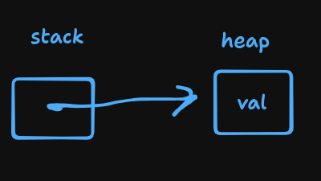

# Stack Memory and Pointers :

in c++ programmer has control over the memory and lifecycle of every variable by default variables lives inside **stack memory** (top to bottom storing)

## A variable :

- name
- type
- value
- location in memory (memory address)

## Variable memory address (reference) :

in c++ & operator returns the memory address of a variable

`&variableName` --> returns the address of variable

### Important notes :

on 64 bit platforms (most computers these days), these pointers may be 64 bit size but some chips only make use of 48 bits (12 hex number) for data addressing.   
also cout may trim leading zeros as well

## Stack memory :

by default every c++ var is stored in **stack memory** --> stack memory assciated with the current function lifetime (when function returns or ends stack memory for function is released)  
Stack always starts from high addresses and grows down.

## Pointers :

a pointer is a variable that stores the memory address of some data (another variable or heap memory) \[level of indirection from the data\]  
`int * ptr = &num;` int \* is the pointer type storing address of integer  
NOTE : pointer is also a stack variable itself

### Dereference Operator :

given a pointer a level of indirection (accessing the actual value pointing to) using deref op (\*pointerName) will return the value of the address stored in pointer

## Never return a reference to a local variable :

as we know the lifetime of local variable is associated with the function lifetime in stack memory so if you returned a reference to local variable this will lead to undefined behaviour

Example :

```cpp
#include <iostream>
#include "Cube.h"
using uiuc::Cube;

Cube * createUnitCube() {
   Cube cube;
   cube.setLength(15);
   return &cube;
}

int main() {
  Cube * c = CreateUnitCube();
  someOtherFunction(); // taking the stack place of the old function
  double a = c->getSurfaceArea();
  double v = c->getVolume();
  return 0;
}
```

&nbsp;

# Heap Memory :

every time we use the **new** keyword a stack variable (pointer) is created and heap memory is blocked for the enough space to store the type and a pointer is made to points to this address in heap



if the stored memory in the heap (or if its pointer to stack) is a user defined object then we can access the methods and members of it using one of these 2 syntax :

- `(*ptrToObj).methodName();`
- `ptrToObj->methodName();`

### Deleting dynamic memory allocated :

using **delete** keyword followed by making the `pointer = nullptr `  will free the reserved memory  
**delete** doesnot remove the pointers instead it just free the memory making the pointer point to memory that doesnot contain any data for us any more (big problem dangling pointer) if you tried to delete it will cause an error.  
solution for this is the **nullptr** set for the pointer variable

## Arrow Operator (->) :

simplier sytnax for derefernce object stored via a pointer to access member functions   
`obj->memberFunc();`

&nbsp;

# Heap memory puzzles :

## Dynamic memory :

```c++
int *x;
int size = 3;
x = new int[size];

for(int i = 0; i < size; i++) {
    x[i] = i + 3;
}

delete[] x;
```

&nbsp;
